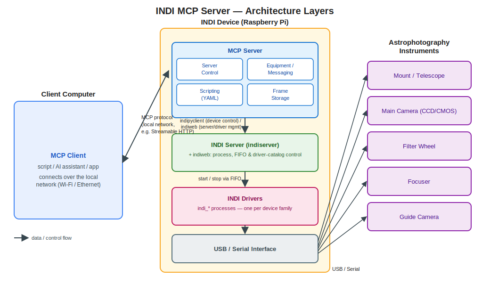

# **INDI MCP Server** Design

This python application exposes INDI messages using MCP to clients that can process MCP requests. This, obviously, includes LLM AI applications but can also include other types of applications that understand the MCP protocol. 

One consideration in the creation of the MCP server is that we would like to run longrunning tasks on the device that is running the INDI server and drivers, that is the device connected to USB to the different astrophotography instruments (camera's, filter wheels, etc...). The MCP server will include more functionality than just forwarding INDI messages, but will able to run sequences or scripts of INDI commands. One obvious usecase is, capturing a sequence of images/frames. The frames will be temporarily stored on the connected device. This prevents issues when the controlling computer, that is for instance, connected via WiFi, looses the connection to the INDI device. The capture sequence will continue because that is running on the INDI device and captured frames will be also be stored on the INDI device. The controlling computer can then retrieve the files when it is connected again.

## Architecture overview

Three tiers are involved: the **Client Computer** (wherever the MCP client runs), the **INDI Device** (the Raspberry Pi, or equivalent, connected to the gear), and the **Astrophotography Instruments** themselves. Within the INDI Device, the MCP Server sits above the INDI Server (`indiserver`), which in turn manages the INDI Drivers that talk to the hardware over USB/serial.



The MCP server will need to be connected to an INDI server, which in turn will be connected to drivers and devices. Several different layers are individually exposed. These (will) include:

* INDI server layer
	* Start an INDI server (with all the possible properties liker port)
	* Stop an INDI server
	* Restart an INDI server
	* Start an INDI driver
	* Stop an INDI driver
* INDI messaging layer - Including a stream of messages being recieved from the INDI server. This will include all INDI message types (definition, new, set, message). The user can also send messages to the INDI server through mcp, thereby the user will be able to control INDI devices. This will be the most basic control layer.
* INDI scripting layer - The MCP server will include scripts for e.g. capturing a frame, capturing a sequence of frames, slewing, etc., that run INDI messages sequentially, with later messages depending on the output of earlier ones. These scripts will be defined in YAML, parsed with a safe loader (`yaml.safe_load`, never the unsafe `yaml.load`) and executed against a fixed, schema-validated set of step primitives rather than an embedded expression language. Because a script is then just declarative data, not executable code, it can safely be authored on the controlling computer and uploaded to the MCP server to run.

## MCP message format

Two different things are meant by "the JSON format" here, and only one of them is ours to design:

* The MCP **envelope** — the JSON-RPC 2.0 request/response shape, `tools/list`, `tools/call`, resources, notifications, etc. — is fully specified by the MCP protocol and implemented by the official Python MCP SDK. This project does not define or customise that layer.
* The **payload** carried inside that envelope — how an INDI property definition, update or command is represented as JSON — is entirely up to us, and is what this section defines.

INDI's own XML wire protocol encodes both the *action* (define / set / command a property) and the *data type* (Text / Number / Switch / Light / BLOB) into a single element name: `defNumberVector`, `setSwitchVector`, `newTextVector`, `delProperty`, `message`, and so on. For the MCP-facing JSON we deliberately avoid mirroring that naming and instead split it into two explicit, descriptive fields:

* `kind` — what is happening: `propertyDefinition` (INDI `def*Vector`), `propertyUpdate` (INDI `set*Vector`), `propertyCommand` (INDI `new*Vector`, client → server), `propertyDeleted` (INDI `delProperty`), or `message` (INDI `message`).
* `type` — the underlying property type: `text`, `number`, `switch`, `light`, or `blob` (INDI's `Text`/`Number`/`Switch`/`Light`/`BLOB` vectors).

For example, an INDI `defNumberVector` becomes:

```json
{
  "kind": "propertyDefinition",
  "type": "number",
  "device": "Telescope Simulator",
  "name": "EQUATORIAL_EOD_COORD",
  "label": "Eq. Coordinates",
  "state": "Ok",
  "perm": "rw",
  "elements": [
    { "name": "RA", "label": "RA (hh:mm:ss)", "value": 0.0 },
    { "name": "DEC", "label": "DEC (dd:mm:ss)", "value": 0.0 }
  ]
}
```

and a client sending an INDI `newNumberVector` to slew becomes a `propertyCommand` with the same `type`/`elements` shape. The exact schema (naming of nested fields, how BLOBs are represented/streamed, etc.) still needs to be worked out in full — this section fixes the naming convention it should follow, not the final schema.

## Calling scripts and script results

This section covers only the JSON shape of *calling* a script and getting its results back over MCP — not the YAML script language itself (which properties/steps/conditionals it supports), which is a separate, later design task.

Because scripts run long-running sequences on the INDI Device and are explicitly meant to keep running even if the Client Computer disconnects (see the intro above), invoking a script is **asynchronous**: the tool call that starts a script returns immediately with a `runId`, rather than blocking until the script finishes. That `runId` is then used both for live progress updates and for polling the outcome after a reconnect.

**Starting a script** — an MCP tool call (e.g. `run_script`) with arguments naming the script and its parameters:

```json
{
  "script": "capture_sequence",
  "parameters": {
    "device": "CCD Simulator",
    "count": 10,
    "exposureSeconds": 30
  }
}
```

The tool call's immediate result acknowledges the run has started, using the same `kind`-based convention as the messaging layer:

```json
{
  "kind": "scriptStarted",
  "runId": "b3f1c2d4-...",
  "script": "capture_sequence",
  "startedAt": "2026-07-14T18:50:00Z",
  "pausable": true
}
```

Whether a run can be paused (see below) depends on the script itself — some scripts have no safe point to suspend at (e.g. mid-slew), others do (e.g. between exposures in a capture sequence). The `pausable` flag reports this upfront, decided by the script definition rather than by the caller.

**Progress** — while connected, the client receives streamed progress notifications for the run; after a reconnect, the same information can be fetched with a `runId` lookup (e.g. a `get_script_status` tool):

```json
{
  "kind": "scriptProgress",
  "runId": "b3f1c2d4-...",
  "step": 3,
  "totalSteps": 10,
  "message": "Capturing frame 3 of 10"
}
```

**Completion** — a terminal status once the run finishes, successfully or not:

```json
{
  "kind": "scriptCompleted",
  "runId": "b3f1c2d4-...",
  "finishedAt": "2026-07-14T19:05:00Z",
  "result": {
    "framesCaptured": 10,
    "frames": [
      { "id": "frame-0001", "path": "M31/2026-07-14/frame-0001.fits" }
    ]
  }
}
```

```json
{
  "kind": "scriptFailed",
  "runId": "b3f1c2d4-...",
  "failedAtStep": 4,
  "error": {
    "message": "Mount slew timed out",
    "propertyState": "Alert"
  }
}
```

**Cancelling** — a `cancel_script` tool call, taking just the `runId`, always applies (any run can be cancelled, regardless of `pausable`). It stops the script promptly at the next safe point and returns a terminal status:

```json
{
  "kind": "scriptCancelled",
  "runId": "b3f1c2d4-...",
  "cancelledAtStep": 4,
  "finishedAt": "2026-07-14T18:55:00Z"
}
```

**Pausing and resuming** — `pause_script` and `resume_script` tool calls, also taking just the `runId`. These only succeed if the run's `pausable` flag was `true`:

```json
{
  "kind": "scriptPaused",
  "runId": "b3f1c2d4-...",
  "pausedAtStep": 4
}
```

```json
{
  "kind": "scriptResumed",
  "runId": "b3f1c2d4-...",
  "resumedAtStep": 4
}
```

If pausing is attempted on a run that doesn't support it, the call is rejected rather than silently ignored or queued:

```json
{
  "kind": "scriptPauseRejected",
  "runId": "b3f1c2d4-...",
  "reason": "This script has no safe point to pause at"
}
```

## Composing scripts

The intent is to start with small, primitive scripts — `cool_camera`, `slew`, `plate_solve`, `select_filter`, `focus`, `capture_frame` — and build realistic imaging sequences out of them, rather than writing every sequence as one long flat list of raw INDI steps. For example, "capture 20×5min frames of M101, refocusing periodically" is really: cool the camera, slew, plate-solve until precision is met, select the filter, then repeatedly focus and capture. **Scripts must be able to call other scripts.**

This doesn't need a separate mechanism — a "call another script" step reuses the exact same `run_script` invocation already defined above, just issued internally instead of from the Client Computer:

```yaml
- step: run_script
  script: capture_frame
  parameters:
    exposureSeconds: 300
    device: "ZWO CCD ASI2600MM Pro"
```

Illustrating the M101 example as composition (not a final step schema — that's still INDIMCP-6's job — just showing the shape):

```yaml
id: capture_sequence_m101
name: Capture 20x5min frames of M101 with periodic refocus
steps:
  - step: run_script
    script: cool_camera
    parameters: { targetTempC: -10 }
  - step: run_script
    script: slew
    parameters: { target: M101 }
  - step: run_script
    script: plate_solve_until_precision
    parameters: { toleranceArcsec: 5 }
  - step: run_script
    script: select_filter
    parameters: { filter: Luminance }
  - repeat: 20
    steps:
      - step: run_script
        script: focus
        every: 2
      - step: run_script
        script: capture_frame
        parameters: { exposureSeconds: 300 }
```

Composability raises a few things the schema and execution engine (INDIMCP-6/INDIMCP-7) need to resolve, noted here so they aren't lost:

* **Same script library, resolved by id.** Sub-scripts are looked up from the same script store a top-level `run_script` call would use — there's no separate "library" of reusable fragments.
* **Cycle detection at validation time.** Loading scripts must build a call graph across the whole library and reject a cycle (A calls B calls A) before anything runs, not discover infinite recursion at runtime.
* **Nested progress, not opaque sub-runs.** A sub-script gets its own `runId` but is tagged with a `parentRunId`, so `scriptProgress`/`scriptCompleted`/etc. events form a walkable execution tree — a client watching the top-level `runId` shouldn't lose visibility into what's happening inside a nested `focus` or `plate_solve_until_precision` call.
* **Cancellation cascades.** Cancelling the top-level run cancels whichever sub-script is currently executing.
* **Pausability becomes dynamic.** Each script declares its own `pausable` flag; for a composite run, the *effective* pausability at any moment is whatever the currently-executing (sub-)script declares — e.g. pausable between `capture_frame` calls but not mid-`slew`. This means `pausable` may need to be re-reported as execution moves between sub-scripts, not fixed once at `scriptStarted` — full mechanics still to be worked out in the schema design.
* **A `repeat`/loop construct is needed** ("do this N times", "repeat until plate-solve precision is met") — kept as a closed, schema-defined construct (a count, or a repeat-until using the same restricted comparison-operator vocabulary already established for conditionals), not an embedded expression language, consistent with the safety rules above.

## Event streams

The `kind`-tagged JSON events above (both the INDI messaging-layer events and the scripting-layer events) aren't only returned as direct tool-call results — long-running scripts and ongoing device activity need a push channel too. This raises the question of whether the INDI messaging layer and the scripting layer should share one event stream or use separate ones.

**Decision: two separate, subscribable streams that share the same `kind`/`type` envelope.**

* `indi://messages` — the INDI messaging layer stream: `propertyDefinition`, `propertyUpdate`, `propertyCommand`, `propertyDeleted`, `message` events. Can optionally be scoped per device, e.g. `indi://messages/{device}`, for clients only interested in one instrument.
* `indi://scripts` — the scripting layer stream: `scriptStarted`, `scriptProgress`, `scriptCompleted`, `scriptFailed`, `scriptCancelled`, `scriptPaused`, `scriptResumed`, `scriptPauseRejected` events. Can optionally be scoped per run, e.g. `indi://scripts/{runId}`.

They're kept separate rather than merged because:

* **Different volume and audience.** INDI property updates can be chatty across many devices; script events are comparatively rare, high-level milestones. A client that only cares whether a capture sequence finished shouldn't have to filter a firehose of property updates, and a device-control UI shouldn't have script bookkeeping mixed into its property feed.
* **Mirrors the layering.** The messaging layer and scripting layer are already separate layers in this design; separate streams keep that boundary intact and let each schema evolve independently.
* **Selective subscription.** A client subscribes only to the stream(s) — and, optionally, the device/run scope — it actually needs.

They share the same envelope convention (not the same channel) so client-side parsing code is uniform across both, and so a `scriptProgress` event can reference the specific `propertyUpdate` that triggered it, e.g.:

```json
{
  "kind": "scriptProgress",
  "runId": "b3f1c2d4-...",
  "step": 3,
  "totalSteps": 10,
  "message": "Capturing frame 3 of 10",
  "triggeredBy": {
    "kind": "propertyUpdate",
    "type": "number",
    "device": "CCD Simulator",
    "name": "CCD_EXPOSURE",
    "state": "Ok"
  }
}
```

**Mechanism:** these are implemented as standard MCP subscribable resources. A client calls `resources/subscribe` on a URI (e.g. `indi://scripts` or `indi://scripts/{runId}`); the server sends `notifications/resources/updated` whenever a new event occurs; the client calls `resources/read` to fetch it. Resource content is a small JSON envelope with a rolling window of recent events, e.g. `{ "events": [ ... ] }`.

**These subscriptions are a best-effort, live-only channel, not the resilience mechanism.** A client that was offline (e.g. the Wi-Fi drop scenario from the intro) should not assume it received every event it missed — it should treat the subscription as "notify me while I'm connected" and use the `runId`-based polling tools (`get_script_status`, etc.) and the event log (below) as the source of truth to catch up after reconnecting.

## Event log

Both streams are backed by a durable **event log**: every `kind`-tagged event (messaging-layer and scripting-layer alike) is written to a local **SQLite** database on the INDI Device before (or as) it's published to subscribers. This is what actually lets a reconnecting client catch up, rather than the live subscription alone.

**Why SQLite, not Postgres:** the INDI Device is a single Raspberry Pi running one MCP server process, and this is a short-retention, single-writer, mostly-local workload. Postgres would mean running a whole separate database service on the Pi — another systemd unit alongside `indiserver` and the MCP server, `initdb` setup, meaningful idle memory overhead, and a system package to install and maintain — for capabilities (concurrent multi-writer access, remote querying, replication) this workload doesn't need. SQLite is embedded (no server process), ships in the Python standard library, and handles our single-writer/occasional-reader access pattern fine in WAL mode.

**Schema (sketch):**

```sql
CREATE TABLE events (
  id INTEGER PRIMARY KEY,
  stream TEXT NOT NULL,       -- 'messages' | 'scripts'
  device TEXT,                -- set for messaging-layer events, else NULL
  run_id TEXT,                -- set for scripting-layer events, else NULL
  occurred_at TEXT NOT NULL,  -- ISO 8601 UTC
  payload TEXT NOT NULL       -- the full kind-tagged JSON event
);
CREATE INDEX idx_events_occurred_at ON events (occurred_at);
CREATE INDEX idx_events_run_id ON events (run_id);
```

**Retention:** events older than **1 day** are purged, since this log exists to bridge reconnects and short-term history — not as permanent storage (captured frames have their own, separate storage; see the scripting layer above). Purging runs periodically (e.g. hourly) as a `DELETE FROM events WHERE occurred_at < ?` against the indexed column, followed by an incremental `VACUUM` to reclaim space and limit SD-card write wear.

**Catch-up query:** a client that reconnects can fetch what it missed with a query against this log — e.g. a `get_events` tool taking `stream`, optional `device`/`run_id` filters, and a `since` timestamp — rather than relying only on `get_script_status` for scripts and having no equivalent history for INDI messages.

## Frame storage metadata

The captured frames themselves (FITS files etc.) are stored as plain files on the INDI Device — see the "INDI scripting layer" and Frame Storage component above. Alongside those files, **metadata about each frame** is tracked in the same local SQLite database as the event log (a second table, not a separate database file — one embedded DB for the INDI Device is enough): which script run produced it, which device captured it, when, and whether it's been transferred to the Client Computer yet.

**Schema (sketch):**

```sql
CREATE TABLE frames (
  id INTEGER PRIMARY KEY,
  frame_id TEXT UNIQUE NOT NULL,  -- id used in MCP-facing responses
  run_id TEXT,                    -- the script run that produced it, NULL if captured ad hoc
  device TEXT NOT NULL,
  path TEXT NOT NULL,             -- path on the INDI Device, relative to the frame storage root
  size_bytes INTEGER,
  captured_at TEXT NOT NULL,      -- ISO 8601 UTC
  transferred_at TEXT             -- NULL until the Client Computer has retrieved it
);
CREATE INDEX idx_frames_run_id ON frames (run_id);
CREATE INDEX idx_frames_captured_at ON frames (captured_at);
```

**Retention differs from the event log:** this table is *not* purged after 1 day — a frame's metadata should live at least as long as the frame file itself, so it stays retrievable across the kind of reconnect scenario described in the intro (Wi-Fi drop during a long capture sequence). Cleanup of a frame (file + its metadata row) is tied to the frame's own lifecycle — e.g. once `transferred_at` is set and the Client Computer has confirmed receipt — not to a fixed time window; the exact cleanup policy is left to the frame storage/transfer implementation (see the corresponding todos) rather than fixed here.

## Retrieving frames

Two separate concerns: finding out what frames exist (metadata, cheap, queried against the `frames` table above), and getting the frame bytes themselves (potentially large FITS files). They're deliberately split into different tool calls rather than one "give me everything" call.

**`list_frames`** — query frame metadata with optional filters, returning `frame_id`s and everything else in the `frames` table except the file path (an internal server-side detail, not exposed to the client):

```json
{
  "runId": "b3f1c2d4-...",
  "device": null,
  "since": "2026-07-14T00:00:00Z",
  "transferredOnly": false
}
```

```json
{
  "kind": "frameList",
  "frames": [
    {
      "frameId": "frame-0001",
      "runId": "b3f1c2d4-...",
      "device": "ZWO CCD ASI2600MM Pro",
      "sizeBytes": 33554432,
      "capturedAt": "2026-07-14T22:04:11Z",
      "transferredAt": null
    }
  ]
}
```

**`get_frame_metadata`** — the same shape for a single `frameId`, useful once a client already knows the id (e.g. from a `scriptCompleted` result's `frames` list).

**Frame content is exposed as an MCP resource**, not embedded in a tool result: each frame gets a `frame://{frame_id}` URI, read via the standard `resources/read` request rather than a bespoke "download" tool — this reuses MCP's existing binary content handling (a base64 `blob` resource content) instead of inventing another transfer mechanism.

**Explicit transfer confirmation, not read-implies-received.** `transferred_at` is *not* set just because the server sent the bytes — a network drop mid-transfer shouldn't be recorded as a successful transfer. Instead, the client calls a `confirm_frame_transfer` tool with the `frameId` once it has verified the frame is safely saved locally; only that sets `transferred_at`. This follows the same "don't trust delivery, wait for acknowledgement" principle already applied to the event log and script status.

**Open question, not resolved here:** MCP's base resource-read mechanism returns the whole content in one response — there's no native chunked/range read. For typical FITS frames this is likely fine, but if frame sizes turn out to be large enough to matter (very large sensors, or long-exposure stacks) we may need our own chunking convention (e.g. `offset`/`length` parameters) layered on top. Deferred until real frame sizes from actual hardware are known rather than solved speculatively now.

## Imaging rig metadata

Scripts (and the MCP server generally) need to know about the physical imaging setup — telescope, focuser, filter wheel, imaging camera, guide camera — not just the live INDI devices currently connected. INDI can report *some* of this at runtime (a camera's pixel count, pixel size and bit depth, and sometimes cooling capability, are commonly exposed through its `CCD_INFO`-family properties), but it has no concept of aperture, focal length, or which physical optical train a device is wired through (imaging vs. guiding) — that's operator knowledge with no protocol representation. A user may also swap rigs entirely between sessions, so the server must be able to store **multiple** rig definitions, not just one.

**Rig definitions are YAML documents, not SQLite rows** — unlike the event log and frame metadata (high-volume, write-heavy, time-indexed operational data, which is why those use SQLite), a rig definition is low-volume, human-curated configuration that changes rarely. This mirrors the scripting layer: declarative data, loaded with `yaml.safe_load`, validated against a schema, and — like scripts — potentially authored on the Client Computer and uploaded, so the same safety discipline applies. Each rig is one YAML file (e.g. under `rigs/*.yaml`), identified by a stable `id` that scripts reference (e.g. a script parameter `"rig": "newtonian-8in"`).

**Schema (sketch):**

```yaml
id: newtonian-8in
name: 8" Newtonian imaging rig
mount:
  device: "Telescope Simulator"
telescope:
  imaging:
    apertureMm: 203
    focalLengthMm: 1000
  guiding:
    apertureMm: 60
    focalLengthMm: 240
focuser:
  device: "Focuser Simulator"
  minPosition: 0
  maxPosition: 50000
filterWheel:
  device: "Filter Wheel Simulator"
  slots:
    1: Luminance
    2: Red
    3: Green
    4: Blue
    5: Ha
    6: OIII
    7: SII
camera:
  imaging:
    device: "ZWO CCD ASI2600MM Pro"
    cooled: true
    pixelsX: 6248
    pixelsY: 4176
    pixelSizeMicron: 3.76
    bitDepth: 16
  guiding:
    device: "ZWO CCD ASI120MM Mini"
    cooled: false
    pixelsX: 1280
    pixelsY: 960
    pixelSizeMicron: 3.75
    bitDepth: 12
```

Every component that corresponds to an actual INDI driver — `mount`, `focuser`, `filterWheel`, `camera.imaging`, `camera.guiding` — carries a `device` field naming that INDI device. The `telescope` block (aperture/focal length) has no `device` of its own since it isn't a driver; it's optical data associated with the `mount` (and, for the guiding train, with whatever the guide camera is attached to).

**The YAML definition is authoritative; live INDI properties are advisory.** Where a field overlaps with something INDI reports (camera pixel size/count/bit depth), the server can cross-check the connected device's live properties against the configured rig and flag a mismatch — but it never overrides the declared config, since INDI can't confirm the parts of the rig it has no visibility into (aperture, focal length, imaging vs. guiding role).

**No silent auto-selection.** Because the server "cannot be certain" which rig is physically mounted, it must not guess. Instead, a `suggest_rig` tool can match currently-connected INDI device names against the `device` fields of configured rigs and propose a likely match, but the operator (or client) explicitly confirms/selects the active rig — scripts and tool calls reference a rig by `id`, never by an auto-detected guess.

### Checking that a rig's devices are present

Once a rig is selected (for a script run, or explicitly via a `check_rig` tool), the server checks every declared `device` field (`mount`, `focuser`, `filterWheel`, `camera.imaging`, `camera.guiding` if present) against the INDI devices currently connected to `indiserver`, and **warns rather than blocks** on any that are missing:

```json
{
  "kind": "rigCheck",
  "rigId": "newtonian-8in",
  "ok": false,
  "missing": ["camera.guiding"],
  "present": ["mount", "focuser", "filterWheel", "camera.imaging"]
}
```

This is a warning, not a hard failure, because a rig might be intentionally used without its guide train (e.g. short unguided subs) — scripts that actually need a missing device will fail naturally when they try to use it.

### Assisting rig creation from connected devices

The server can also help *build* a rig definition from whatever is currently connected, rather than requiring one to be hand-written from scratch. Two things it already has access to make this possible:

* **Device family classification** — the INDI driver catalog (already used for driver management, via `indiweb`'s `DriverCollection`) groups every known driver by family (`CCD`s, `Filter Wheels`, `Focusers`, `Telescopes`, ...), so a connected device's driver tells us whether it's a camera, filter wheel, focuser, or mount.
* **Live device state** — the currently connected/defined INDI devices (from the messaging layer) plus whatever properties they expose (`CCD_INFO` for pixel geometry, `FILTER_NAME` for configured filter names, focuser range properties where available).

A `draft_rig` tool combines these into a pre-filled rig YAML skeleton: detected camera(s) go into `camera.imaging`/`camera.guiding.device` with pixel/bit-depth fields filled from `CCD_INFO`, a detected filter wheel's `device` and — where `FILTER_NAME` is populated — its `slots` are pre-filled, a detected focuser's `device` (and range, if exposed) is filled in, and a detected mount's `device` is filled in. Fields INDI has no way to supply — `apertureMm`/`focalLengthMm`, and which camera/telescope is the *imaging* vs. *guiding* train when more than one is connected — are left as placeholders for the operator to complete. The result is a **draft**, reviewed and saved by the operator, not an automatically-finalized rig — consistent with the YAML-is-authoritative, no-silent-auto-selection rule above.