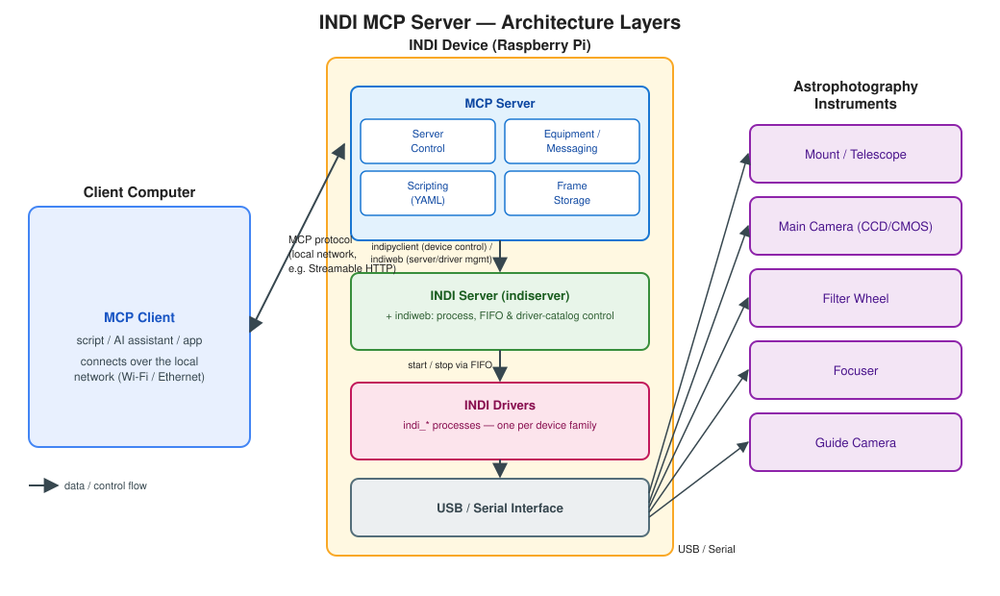

# **INDI MCP Server** Design

This python application exposes INDI messages using MCP to clients that can process MCP requests. This, obviously, includes LLM AI applications but can also include other types of applications that understand the MCP protocol. 

One consideration in the creation of the MCP server is that we would like to run longrunning tasks on the device that is running the INDI server and drivers, that is the device connected to USB to the different astrophotography instruments (camera's, filter wheels, etc...). The MCP server will include more functionality than just forwarding INDI messages, but will able to run sequences or scripts of INDI commands. One obvious usecase is, capturing a sequence of images/frames. The frames will be temporarily stored on the connected device. This prevents issues when the controlling computer, that is for instance, connected via WiFi, looses the connection to the INDI device. The capture sequence will continue because that is running on the INDI device and captured frames will be also be stored on the INDI device. The controlling computer can then retrieve the files when it is connected again.

## Architecture overview

Three tiers are involved: the **Client Computer** (wherever the MCP client runs), the **INDI Device** (the Raspberry Pi, or equivalent, connected to the gear), and the **Astrophotography Instruments** themselves. Within the INDI Device, the MCP Server sits above the INDI Server (`indiserver`), which in turn manages the INDI Drivers that talk to the hardware over USB/serial.



The MCP server will need to be connected to an INDI server, which in turn will be connected to drivers and devices. Several different layers are individually exposed. These (will) include:

* INDI server layer
	* Start an INDI server (with all the possible properties liker port)
	* Stop an INDI server
	* Restart an INDI server
	* Start an INDI driver
	* Stop an INDI driver
* INDI messaging layer - Including a stream of messages being recieved from the INDI server. This will include all INDI message types (definition, new, set, message). The user can also send messages to the INDI server through mcp, thereby the user will be able to control INDI devices. This will be the most basic control layer.
* INDI scripting layer - The MCP server will include scripts for e.g. capturing a frame, capturing a sequence of frames, slewing, etc., that run INDI messages sequentially, with later messages depending on the output of earlier ones. These scripts will be defined in YAML, parsed with a safe loader (`yaml.safe_load`, never the unsafe `yaml.load`) and executed against a fixed, schema-validated set of step primitives rather than an embedded expression language. Because a script is then just declarative data, not executable code, it can safely be authored on the controlling computer and uploaded to the MCP server to run. See [ScriptSchema.md](ScriptSchema.md) for the full YAML schema.

## MCP message format

Two different things are meant by "the JSON format" here, and only one of them is ours to design:

* The MCP **envelope** — the JSON-RPC 2.0 request/response shape, `tools/list`, `tools/call`, resources, notifications, etc. — is fully specified by the MCP protocol and implemented by the official Python MCP SDK. This project does not define or customise that layer.
* The **payload** carried inside that envelope — how an INDI property definition, update or command is represented as JSON — is entirely up to us, and is what this section defines.

INDI's own XML wire protocol encodes both the *action* (define / set / command a property) and the *data type* (Text / Number / Switch / Light / BLOB) into a single element name: `defNumberVector`, `setSwitchVector`, `newTextVector`, `delProperty`, `message`, and so on. For the MCP-facing JSON we deliberately avoid mirroring that naming and instead split it into two explicit, descriptive fields:

* `kind` — what is happening: `propertyDefinition` (INDI `def*Vector`), `propertyUpdate` (INDI `set*Vector`), `propertyCommand` (INDI `new*Vector`, client → server), `propertyDeleted` (INDI `delProperty`), or `message` (INDI `message`).
* `type` — the underlying property type: `text`, `number`, `switch`, `light`, or `blob` (INDI's `Text`/`Number`/`Switch`/`Light`/`BLOB` vectors).

For example, an INDI `defNumberVector` becomes:

```json
{
  "kind": "propertyDefinition",
  "type": "number",
  "device": "Telescope Simulator",
  "name": "EQUATORIAL_EOD_COORD",
  "label": "Eq. Coordinates",
  "state": "Ok",
  "perm": "rw",
  "elements": [
    { "name": "RA", "label": "RA (hh:mm:ss)", "value": 0.0 },
    { "name": "DEC", "label": "DEC (dd:mm:ss)", "value": 0.0 }
  ]
}
```

and a client sending an INDI `newNumberVector` to slew becomes a `propertyCommand` with the same `type`/`elements` shape. This section fixes the naming convention the schema follows; see [MessageSchema.md](MessageSchema.md) (INDIMCP-12) for the full field-by-field reference — nested element shapes per type, how BLOBs are represented (never inlined; fetched separately), and the error/state fields, plus the scripting layer's `runId`-based status envelope which shares this same `kind`/`type` convention.

## Calling scripts and script results

This section covers only the JSON shape of *calling* a script and getting its results back over MCP — not the YAML script language itself (which properties/steps/conditionals it supports), which is a separate, later design task.

Because scripts run long-running sequences on the INDI Device and are explicitly meant to keep running even if the Client Computer disconnects (see the intro above), invoking a script is **asynchronous**: the tool call that starts a script returns immediately with a `runId`, rather than blocking until the script finishes. That `runId` is then used both for live progress updates and for polling the outcome after a reconnect.

**Starting a script** — an MCP tool call (e.g. `run_script`) naming the script, the rig whose components its steps resolve against (see [ScriptSchema.md § Resolving roles to devices](ScriptSchema.md#resolving-roles-to-devices)), and its parameters:

```json
{
  "script": "capture_sequence",
  "rigId": "newtonian-8in",
  "parameters": {
    "count": 10,
    "exposureSeconds": 30
  }
}
```

The tool call's immediate result acknowledges the run has started, using the same `kind`-based convention as the messaging layer:

```json
{
  "kind": "scriptStarted",
  "runId": "b3f1c2d4-...",
  "script": "capture_sequence",
  "startedAt": "2026-07-14T18:50:00Z",
  "pausable": true
}
```

Whether a run can be paused (see below) depends on the script itself — some scripts have no safe point to suspend at (e.g. mid-slew), others do (e.g. between exposures in a capture sequence). The `pausable` flag reports this upfront, decided by the script definition rather than by the caller.

**Named convenience wrappers** (INDIMCP-49, consolidated INDIMCP-116) — the most common built-in scripts (`park`, `unpark`, `slew`, `cool_camera`, `cooler_on`, `cooler_off`, `abort_exposure`, `select_filter`, `set_focus_position`, `connect`, `disconnect`, `capture_frame`, `track_off`, `set_track_mode`, `set_custom_tracking_rate`) are each still one `action` of one of five typed MCP tools grouped by device role — `mount_action`, `camera_action`, `filter_wheel_action`, `focuser_action`, `set_connection` (e.g. `mount_action(rigId, action="slew", ra=..., dec=...)`) — rather than requiring every caller to go through `run_script("slew", rigId, {"ra": ..., "dec": ...})` directly. (Each of those fifteen wrapper tools originally existed one-to-one with these script names; INDIMCP-116 grouped them by device to shrink the overall MCP tool count — see `docs/ToolSurfaceRedesign.md`.) Each still just picks which built-in script to run based on `action` — a thin passthrough to the exact same `run_script`/`start_script` machinery — same `runId`, same asynchronous "returns immediately" contract, same `manage_script_run` story — so nothing above changes; this is purely about giving MCP clients a better-typed, more discoverable entry point for a single common action. It doesn't replace the scripting layer: the underlying `scripts/*.yaml` file still exists and is still what a composed sequence's own `run_script`/`repeat`/`if` steps call into (e.g. `capture_light_sequence` calling `cool_camera` and `select_filter` internally) — scripts remain how more complex, multi-step sequences get built and reused, while the wrapper tools exist for a single action taken on its own.

**Progress** — while connected, the client receives streamed progress notifications for the run; after a reconnect, the same information can be fetched with a `runId` lookup (`manage_script_run`'s `action="status"`):

```json
{
  "kind": "scriptProgress",
  "runId": "b3f1c2d4-...",
  "step": 3,
  "totalSteps": 10,
  "message": "Capturing frame 3 of 10",
  "role": "camera",
  "device": "ZWO CCD ASI2600MM Pro"
}
```

`role`/`device` identify the rig component the step about to execute acts on — `role` exactly
as the step (or its `condition`, for `wait_for`/`if`) declares it, `device` the INDI device
name that role currently resolves to. Both are `null` for a step with no single role of its
own (`run_script`, a `count`-based `repeat`, ...).

**Status messages** — a lower-noise, message-only notification a step can emit mid-execution,
distinct from the numbered `scriptProgress` events above (which fire before every step
regardless of whether there's anything to say):

```json
{
  "kind": "scriptMessage",
  "runId": "b3f1c2d4-...",
  "message": "Captured frame frame-42 (18874368 bytes)",
  "role": "camera",
  "device": "ZWO CCD ASI2600MM Pro"
}
```

Not every primitive emits these — only ones with per-invocation activity worth surfacing
live (`capture_frame` reporting the frame it just saved is the first case). Published to
`indi://mcp-server/scripts` and the durable event log like every other status here, but **not** part of
`manage_script_run`'s `action="status"` "current status" reconnect story — it's a point-in-time
note, not a change to the run's state, so it never overwrites what that action returns for a
`runId` (a reconnecting client polling for "what's the run doing right now" still gets the
most recent `scriptProgress`/terminal status, not a stale message).

**Completion** — a terminal status once the run finishes, successfully or not:

```json
{
  "kind": "scriptCompleted",
  "runId": "b3f1c2d4-...",
  "finishedAt": "2026-07-14T19:05:00Z",
  "result": {
    "scriptId": "capture_sequence",
    "stepsExecuted": 42,
    "framesCaptured": 10
  }
}
```

`result` is intentionally a summary, not a full frame listing — a client that needs the
captured frames themselves calls `list_frames(runId=...)` (see "Retrieving frames" below),
rather than `scriptCompleted` duplicating data that already lives in the `frames` table.

```json
{
  "kind": "scriptFailed",
  "runId": "b3f1c2d4-...",
  "failedAtStep": 4,
  "error": {
    "message": "Mount slew timed out",
    "propertyState": "Alert"
  }
}
```

**Cancelling** — `manage_script_run`'s `action="cancel"`, taking just the `runId`, always applies (any run can be cancelled, regardless of `pausable`). It stops the script promptly at the next safe point and returns a terminal status:

```json
{
  "kind": "scriptCancelled",
  "runId": "b3f1c2d4-...",
  "cancelledAtStep": 4,
  "finishedAt": "2026-07-14T18:55:00Z"
}
```

Cancelling while a `capture_frame` step's exposure is still in flight also sends `CCD_ABORT_EXPOSURE` to the camera, best-effort, before returning `scriptCancelled` (INDIMCP-86) — otherwise the camera would keep physically exposing after the run itself has already stopped. The same abort is sent, best-effort, if that exposure wait instead times out (a hung driver or flaky USB connection never bringing `CCD_EXPOSURE` to `Ok`) before the run fails with `scriptFailed` (INDIMCP-92) — same underlying gap, just the second trigger that can leave a `capture_frame` exposure abandoned mid-flight. This is the only step type cancellation/timeout reaches into like this; every other step still just stops promptly at the next safe point with no device-specific cleanup. `camera_action`'s `action="abort_exposure"` (above) also exists as its own call outside a script run, for aborting an exposure standalone.

**Pausing and resuming** — `manage_script_run`'s `action="pause"`/`"resume"`, also taking just the `runId`. These only succeed if the run's `pausable` flag was `true`:

```json
{
  "kind": "scriptPaused",
  "runId": "b3f1c2d4-...",
  "pausedAtStep": 4
}
```

```json
{
  "kind": "scriptResumed",
  "runId": "b3f1c2d4-...",
  "resumedAtStep": 4
}
```

If pausing is attempted on a run that doesn't support it, the call is rejected rather than silently ignored or queued:

```json
{
  "kind": "scriptPauseRejected",
  "runId": "b3f1c2d4-...",
  "reason": "This script has no safe point to pause at"
}
```

## Composing scripts

The intent is to start with small, primitive scripts — `cool_camera`, `slew`, `plate_solve`, `select_filter`, `focus`, `capture_frame` — and build realistic imaging sequences out of them, rather than writing every sequence as one long flat list of raw INDI steps. For example, "capture 20×5min frames of M101, refocusing periodically" is really: cool the camera, slew, plate-solve until precision is met, select the filter, then repeatedly focus and capture. **Scripts must be able to call other scripts.**

This doesn't need a separate mechanism — a "call another script" step reuses the exact same `run_script` invocation already defined above, just issued internally instead of from the Client Computer:

```yaml
- step: run_script
  script: capture_frame
  parameters:
    exposureSeconds: 300
    device: "ZWO CCD ASI2600MM Pro"
```

Illustrating the M101 example as composition (an early sketch of the shape — see [ScriptSchema.md](ScriptSchema.md) for the schema this settled into, including `role`-based device resolution rather than a hardcoded `device`):

```yaml
id: capture_sequence_m101
name: Capture 20x5min frames of M101 with periodic refocus
steps:
  - step: run_script
    script: cool_camera
    parameters: { targetTempC: -10 }
  - step: run_script
    script: slew
    parameters: { target: M101 }
  - step: run_script
    script: plate_solve_until_precision
    parameters: { toleranceArcsec: 5 }
  - step: run_script
    script: select_filter
    parameters: { filter: Luminance }
  - repeat: 20
    steps:
      - step: run_script
        script: focus
        every: 2
      - step: run_script
        script: capture_frame
        parameters: { exposureSeconds: 300 }
```

Composability raises a few things the schema and execution engine (INDIMCP-6/INDIMCP-7) need to resolve, noted here so they aren't lost — see [ScriptSchema.md § Script composition](ScriptSchema.md#script-composition) for how INDIMCP-6 settled these:

* **Same script library, resolved by id.** Sub-scripts are looked up from the same script store a top-level `run_script` call would use — there's no separate "library" of reusable fragments.
* **Cycle detection at validation time.** Loading scripts must build a call graph across the whole library and reject a cycle (A calls B calls A) before anything runs, not discover infinite recursion at runtime.
* **Nested progress, not opaque sub-runs.** A sub-script gets its own `runId` but is tagged with a `parentRunId`, so `scriptProgress`/`scriptCompleted`/etc. events form a walkable execution tree — a client watching the top-level `runId` shouldn't lose visibility into what's happening inside a nested `focus` or `plate_solve_until_precision` call.
* **Cancellation cascades.** Cancelling the top-level run cancels whichever sub-script is currently executing.
* **Pausability becomes dynamic.** Each script declares its own `pausable` flag; for a composite run, the *effective* pausability at any moment is whatever the currently-executing (sub-)script declares — e.g. pausable between `capture_frame` calls but not mid-`slew`. This means `pausable` may need to be re-reported as execution moves between sub-scripts, not fixed once at `scriptStarted`.
* **A `repeat`/loop construct is needed** ("do this N times", "repeat until plate-solve precision is met") — kept as a closed, schema-defined construct (a count, or a repeat-until using the same restricted comparison-operator vocabulary already established for conditionals), not an embedded expression language, consistent with the safety rules above.

## Event streams

The `kind`-tagged JSON events above (both the INDI messaging-layer events and the scripting-layer events) aren't only returned as direct tool-call results — long-running scripts and ongoing device activity need a push channel too. This raises the question of whether the INDI messaging layer and the scripting layer should share one event stream or use separate ones.

**Decision: two families of subscribable stream that share the same `kind`/`type` envelope —
`indi://messages` for raw INDI protocol traffic, `indi://mcp-server` for everything about this
server's own operation.**

* `indi://messages` — the INDI messaging layer stream: `propertyDefinition`, `propertyUpdate`, `propertyCommand`, `propertyDeleted`, `message` events. Can optionally be scoped per device, e.g. `indi://messages/{device}`, for clients only interested in one instrument.
* `indi://mcp-server/scripts` — the scripting layer stream: `scriptStarted`, `scriptProgress`, `scriptCompleted`, `scriptFailed`, `scriptCancelled`, `scriptPaused`, `scriptResumed`, `scriptPauseRejected` events. Can optionally be scoped per run, e.g. `indi://mcp-server/scripts/{runId}`. Originally shipped as its own top-level `indi://scripts` stream (INDIMCP-14); moved under `indi://mcp-server` by INDIMCP-57 once a second server-operational stream (below) needed the same non-protocol home.
* `indi://mcp-server/connection` — connection-lifecycle events (INDIMCP-57): `connectionMade`/`connectionLost`, each carrying a `target` of `"server"` (this server's own TCP link to `indiserver`, sourced from `indipyclient`'s local `ConnectionMade`/`ConnectionLost` events), `"indiserver"` (the `indiserver` process itself), or a driver's catalog label (an individual driver process). Can optionally be scoped per target, e.g. `indi://mcp-server/connection/indiserver`.

They're kept as separate streams rather than merged with `indi://messages` because:

* **Different volume and audience.** INDI property updates can be chatty across many devices; script/connection events are comparatively rare, high-level milestones. A client that only cares whether a capture sequence finished (or the server lost its link to `indiserver`) shouldn't have to filter a firehose of property updates, and a device-control UI shouldn't have that bookkeeping mixed into its property feed.
* **Mirrors the layering.** The messaging layer is a distinct layer in this design from everything about the MCP server's own operation (script runs, connection lifecycle); separate streams keep that boundary intact and let each schema evolve independently.
* **Selective subscription.** A client subscribes only to the stream(s) — and, optionally, the device/run/target scope — it actually needs.

`indi://mcp-server/scripts` and `indi://mcp-server/connection` are themselves two separate sub-streams (each independently subscribable/scoped), not one combined feed — script-run progress and connection lifecycle are unrelated in cause and cadence, and merging them would force every subscriber to filter the other one out client-side. What they share is that neither is raw INDI wire protocol, which is the one thing `indi://messages` is reserved for.

They share the same envelope convention (not the same channel) so client-side parsing code is uniform across both, and so a `scriptProgress` event can reference the specific `propertyUpdate` that triggered it, e.g.:

```json
{
  "kind": "scriptProgress",
  "runId": "b3f1c2d4-...",
  "step": 3,
  "totalSteps": 10,
  "message": "Capturing frame 3 of 10",
  "triggeredBy": {
    "kind": "propertyUpdate",
    "type": "number",
    "device": "CCD Simulator",
    "name": "CCD_EXPOSURE",
    "state": "Ok"
  }
}
```

**Mechanism:** these are implemented as standard MCP subscribable resources. A client calls `resources/subscribe` on a URI (e.g. `indi://mcp-server/scripts` or `indi://mcp-server/scripts/{runId}`); the server sends `notifications/resources/updated` whenever a new event occurs; the client calls `resources/read` to fetch it. Resource content is a small JSON envelope with a rolling window of recent events, e.g. `{ "events": [ ... ] }`.

**These subscriptions are a best-effort, live-only channel, not the resilience mechanism.** A client that was offline (e.g. the Wi-Fi drop scenario from the intro) should not assume it received every event it missed — it should treat the subscription as "notify me while I'm connected" and use the `runId`-based polling tools (`manage_script_run`'s `action="status"`, etc.) and the event log (below) as the source of truth to catch up after reconnecting.

## Event log

All these streams are backed by a durable **event log**: every `kind`-tagged event (messaging-layer, scripting-layer, and connection-lifecycle alike, the latter added by INDIMCP-57) is written to a local **SQLite** database on the INDI Device before (or as) it's published to subscribers. This is what actually lets a reconnecting client catch up, rather than the live subscription alone.

**Why SQLite, not Postgres:** the INDI Device is a single Raspberry Pi running one MCP server process, and this is a short-retention, single-writer, mostly-local workload. Postgres would mean running a whole separate database service on the Pi — another systemd unit alongside `indiserver` and the MCP server, `initdb` setup, meaningful idle memory overhead, and a system package to install and maintain — for capabilities (concurrent multi-writer access, remote querying, replication) this workload doesn't need. SQLite is embedded (no server process), ships in the Python standard library, and handles our single-writer/occasional-reader access pattern fine in WAL mode.

**Schema (sketch):**

```sql
CREATE TABLE events (
  id INTEGER PRIMARY KEY,
  stream TEXT NOT NULL,       -- 'messages' | 'scripts' | 'connection'
  device TEXT,                -- set for messaging-layer events, else NULL
  run_id TEXT,                -- set for scripting-layer events, else NULL
  target TEXT,                -- set for connection-lifecycle events, else NULL
  occurred_at TEXT NOT NULL,  -- ISO 8601 UTC
  payload TEXT NOT NULL       -- the full kind-tagged JSON event
);
CREATE INDEX idx_events_occurred_at ON events (occurred_at);
CREATE INDEX idx_events_run_id ON events (run_id);
CREATE INDEX idx_events_target ON events (target);
```

**Retention:** events older than **1 day** are purged, since this log exists to bridge reconnects and short-term history — not as permanent storage (captured frames have their own, separate storage; see the scripting layer above). Purging runs periodically (e.g. hourly) as a `DELETE FROM events WHERE occurred_at < ?` against the indexed column, followed by an incremental `VACUUM` to reclaim space and limit SD-card write wear.

**Catch-up query:** a client that reconnects can fetch what it missed with a query against this log — e.g. a `get_events` tool taking `stream`, optional `device`/`run_id`/`target` filters, and a `since` timestamp — rather than relying only on `manage_script_run`'s `action="status"` for scripts and having no equivalent history for INDI messages or connection state.

**Backpressure on the write path (INDIMCP-59):** durable writes are serialized through a single bounded in-process queue and one persistent worker task, not a fresh task per event. A "chatty" device's `propertyUpdate`s can arrive many times a second, and spawning an unbounded `asyncio.to_thread` write per event would let arbitrarily many threads pile up all contending for the same SQLite write lock — on a resource-constrained Pi, that risks exhausting the process's thread pool entirely, starving every other blocking call sharing it (frame storage, the retention purge). If the queue fills faster than the worker can drain it, the *oldest* queued event is dropped to make room for the newest, matching the same bounded, newest-biased policy the in-memory live-view buffers already use, rather than letting the queue grow without limit.

## Frame storage metadata

The captured frames themselves (FITS files etc.) are stored as plain files on the INDI Device — see the "INDI scripting layer" and Frame Storage component above. Alongside those files, **metadata about each frame** is tracked in the same local SQLite database as the event log (a second table, not a separate database file — one embedded DB for the INDI Device is enough): which script run produced it, which device captured it, when, and whether it's been transferred to the Client Computer yet. Separately from this metadata, `capture_frame` also best-effort enriches the frame's own FITS header content with celestial context — see [FitsHeaders.md](FitsHeaders.md).

**Schema (sketch):**

```sql
CREATE TABLE frames (
  id INTEGER PRIMARY KEY,
  frame_id TEXT UNIQUE NOT NULL,  -- id used in MCP-facing responses
  run_id TEXT,                    -- the script run that produced it, NULL if captured ad hoc
  device TEXT NOT NULL,
  path TEXT NOT NULL,             -- path on the INDI Device, relative to the frame storage root
  size_bytes INTEGER,
  checksum_sha256 TEXT,           -- SHA-256 hex digest of the frame's bytes at capture time
  captured_at TEXT NOT NULL,      -- ISO 8601 UTC
  transferred_at TEXT             -- NULL until the Client Computer has retrieved it
);
CREATE INDEX idx_frames_run_id ON frames (run_id);
CREATE INDEX idx_frames_captured_at ON frames (captured_at);
```

**Retention differs from the event log:** this table is *not* purged after 1 day — a frame's metadata should live at least as long as the frame file itself, so it stays retrievable across the kind of reconnect scenario described in the intro (Wi-Fi drop during a long capture sequence). Cleanup of a frame (file + its metadata row) is tied to the frame's own lifecycle — e.g. once `transferred_at` is set and the Client Computer has confirmed receipt — not to a fixed time window; the exact cleanup policy is left to the frame storage/transfer implementation (see the corresponding todos) rather than fixed here.

## Retrieving frames

Two separate concerns: finding out what frames exist (metadata, cheap, queried against the `frames` table above), and getting the frame bytes themselves (potentially large FITS files). They're deliberately split into different tool calls rather than one "give me everything" call.

**`list_frames`** — query frame metadata with optional filters, returning `frame_id`s and everything else in the `frames` table except the file path (an internal server-side detail, not exposed to the client). `transferred` is tri-state (omitted/`null` = every frame, `true` = only already-transferred ones, `false` = only ones still waiting to be retrieved) rather than a one-directional `transferredOnly` flag, since knowing what's still pending is just as useful as seeing what's done — e.g. before deciding it's safe to run `purge_transferred_frames` (below). Returns a bare array, not a `kind`-tagged envelope — matching every other list-shaped tool in this codebase (`list_config`, `list_indi_drivers`, ...), none of which wrap their results either; `kind` tags are for single event/status-shaped objects, not list results:

```json
{
  "runId": "b3f1c2d4-...",
  "device": null,
  "since": "2026-07-14T00:00:00Z",
  "transferred": false
}
```

```json
[
  {
    "frameId": "frame-0001",
    "runId": "b3f1c2d4-...",
    "device": "ZWO CCD ASI2600MM Pro",
    "sizeBytes": 33554432,
    "checksumSha256": "b1946ac92492d2347c6235b4d2611184...",
    "capturedAt": "2026-07-14T22:04:11Z",
    "transferredAt": null,
    "downloadUrl": "http://indi-mcp.local:8000/frames/frame-0001",
    "issues": []
  }
]
```

**`get_frame_metadata`** — the same shape for a single `frameId`, useful once a client already knows the id (e.g. from a `list_frames(runId=...)` call made after a `scriptCompleted` event).

**Frame content is downloaded over plain HTTP, not read as an MCP resource** (INDIMCP-89, superseding the original `frame://{frame_id}` resource design below). Each frame's `downloadUrl` above points at `GET /frames/{frameId}` — a plain Starlette route registered via FastMCP's `custom_route` (see `server.py`'s `download_frame`), living on the same host/port as the MCP endpoint itself but entirely outside the MCP session/protocol. The handler streams the file straight off disk (`FileResponse`); no base64 encoding, no full in-memory buffering, no single-message size ceiling. `downloadUrl` is `null` when the server has no HTTP listener to build one from (the `stdio` transport, e.g. local testing) — there's nothing to point at in that case.

Originally, frame content was exposed as an MCP resource instead: each frame got a `frame://{frame_id}` URI, read via the standard `resources/read` request, reusing MCP's existing binary content handling (a base64 `blob` resource content) rather than inventing a separate transfer mechanism. This was deliberately left open at the time ("deferred until real frame sizes from actual hardware are known rather than solved speculatively now") — MCP's resource-read mechanism returns the whole content in one JSON-RPC response, with no native chunked/range read to fall back on for a large one. Real frame sizes turned out to matter: an 18MB raw (~23MB base64-encoded) dark frame disconnected a real MCP client reading it this way. Since that's a protocol-level ceiling (any MCP client hits it eventually, just at a different size threshold depending on its own timeout/memory limits, not something specific to one client implementation), the fix moves the bytes outside the MCP protocol entirely rather than inventing an offset/length chunking convention on top of it. `frame://{frame_id}` itself has been removed — there was no safe use case left for it once it broke on real frame sizes, and keeping two ways to fetch the same bytes would mean two code paths to maintain and test for one that's known to fail. The new endpoint is unauthenticated, same as every MCP tool/resource this server already exposes over `streamable-http` (see Deployment.md's Hardening notes) — this doesn't introduce a new class of exposure, just a new URL path with the same trust model. The URL's host comes from `socket.gethostname()`, not the server's own bind address (`--host`, typically the wildcard `0.0.0.0` in production per Deployment.md, not itself a reachable client-facing address).

**Explicit transfer confirmation, not read-implies-received.** `transferred_at` is *not* set just because the server sent the bytes — a network drop mid-transfer shouldn't be recorded as a successful transfer. Instead, the client calls a `confirm_frame_transfer` tool with the `frameId` once it has verified the frame is safely saved locally; only that sets `transferred_at`. This follows the same "don't trust delivery, wait for acknowledgement" principle already applied to the event log and script status. `checksumSha256` (INDIMCP-95) lets that verification check the downloaded bytes' actual content, not just their length against `sizeBytes` — a truncated-but-coincidentally-same-length transfer would pass a size check but fail a hash comparison. `checksumSha256` is `null` for a frame captured before checksum support existed (its row predates the `checksum_sha256` column and was carried forward by a schema migration with nothing to hash) — always populated for every frame captured since. When it's `null`, `list_frames`/`get_frame_metadata` also add a `frameChecksumMissing` `WARNING` to that frame's `issues` array (the same `kind`/`severity`-tagged `Issue` shape `run_script` status responses use for non-fatal conditions), so a client can surface *why* the checksum is missing rather than treating a `null` as unexplained.

## Deleting frames

The INDI Device's own storage is limited, so frames need cleaning up once the Client Computer has its own copy — but never automatically: the server itself never deletes a frame on its own initiative, only in direct response to one of these two client-initiated tool calls.

**`delete_frame`** — deletes one frame's file and metadata row, identified by `frameId`. Refuses (raises an error) if that frame's `transferredAt` isn't set yet, unless the caller explicitly passes `requireTransferred: false` — deleting the only copy of a frame the Client Computer never actually confirmed receiving would be data loss, so this is safe by default rather than trusting every caller to check first.

**`purge_transferred_frames`** — bulk-deletes every already-transferred frame captured more than a caller-supplied age ago (`olderThanDays`, always explicit — never a hardcoded default, since how much local retention makes sense depends on the Pi's actual free storage and how often the operator downloads frames). Age is measured from `capturedAt`, not `transferredAt`. Returns the metadata of every frame actually deleted, most recently captured first.

## Imaging rig metadata

Scripts (and the MCP server generally) need to know about the physical imaging setup — telescope, focuser, filter wheel, imaging camera, guide camera — not just the live INDI devices currently connected. INDI can report *some* of this at runtime (a camera's pixel count, pixel size and bit depth, and sometimes cooling capability, are commonly exposed through its `CCD_INFO`-family properties), but it has no concept of aperture, focal length, or which physical optical train a device is wired through (imaging vs. guiding) — that's operator knowledge with no protocol representation. A user may also swap rigs entirely between sessions, so the server must be able to store **multiple** rig definitions, not just one.

**Rig definitions are YAML documents, not SQLite rows** — unlike the event log and frame metadata (high-volume, write-heavy, time-indexed operational data, which is why those use SQLite), a rig definition is low-volume, human-curated configuration that changes rarely. This mirrors the scripting layer: declarative data, loaded with `yaml.safe_load`, validated against a schema, and — like scripts — potentially authored on the Client Computer and uploaded, so the same safety discipline applies. Each rig is one YAML file (e.g. under `rigs/*.yaml`), identified by a stable `id` that a `run_script` call references via `rigId` (see [ScriptSchema.md § Resolving roles to devices](ScriptSchema.md#resolving-roles-to-devices)).

**Schema (sketch):**

```yaml
id: newtonian-8in
name: 8" Newtonian imaging rig
components:
  - role: mount
    id: mount-1
    device: "Telescope Simulator"
  - role: telescope
    id: main-scope
    apertureMm: 203
    focalLengthMm: 1000
  - role: focuser
    id: focuser-1
    device: "Focuser Simulator"
    minPosition: 0
    maxPosition: 50000
  - role: filterWheel
    id: filter-wheel-1
    device: "Filter Wheel Simulator"
    slots:
      1: Luminance
      2: Red
      3: Green
      4: Blue
      5: Ha
      6: OIII
      7: SII
  - role: rotator
    id: rotator-1
    device: "Rotator Simulator"
  - role: camera
    id: "SN12345"
    make: ZWO
    model: ASI2600MM Pro
    device: "ZWO CCD ASI2600MM Pro"
    cooled: true
    pixelsX: 6248
    pixelsY: 4176
    pixelSizeMicron: 3.76
    bitDepth: 16
  - role: guideTelescope
    id: guide-scope
    apertureMm: 60
    focalLengthMm: 240
  - role: guideCamera
    id: "SN67890"
    make: ZWO
    model: ASI120MM Mini
    device: "ZWO CCD ASI120MM Mini"
    cooled: false
    pixelsX: 1280
    pixelsY: 960
    pixelSizeMicron: 3.75
    bitDepth: 12
  - role: powerHub
    id: power-hub-1
    device: "Pegasus PPBA"
  - role: observatoryControl
    id: dome-1
    device: "Dome Simulator"
  - role: flatScreen
    id: flat-screen-1
    device: "Flat Panel Simulator"
  - role: dewHeater
    id: dew-heater-a
    device: "Pegasus PPBA:Dew A"
  - role: dewHeater
    id: dew-heater-b
    device: "Pegasus PPBA:Dew B"
```

**A rig is a flat list of components, not a nested structure of trains/OTAs/mounts.** A more
faithful model of a real setup would separate out an imaging train (camera, filter wheel,
rotator, off-axis guider — things that stay together when swapped onto a different telescope),
an optical tube assembly (telescope, focuser, flat-field light — things that stay together when
moved to a different mount), the mount itself, and the observatory, each cross-referencing the
others. That's deferred as unnecessary complexity for now — a flat `components` list is enough
to declare "this is what's mounted this session," which is all `rig_diagnostics`'s `suggest`/`check` actions need.
Structure can be reintroduced later once real rig files show what's actually worth splitting
out.

Each entry has a `role` and an `id` (both required), plus whichever other fields are meaningful
for that role. `role` is one of a known set (`mount`, `telescope`, `guideTelescope`, `camera`,
`guideCamera`, `focuser`, `filterWheel`, `rotator`, `powerHub`, `observatoryControl`,
`flatScreen`, `dewHeater`) or any other string, so a rig can still declare a component type this
schema's authors haven't thought of without a schema change. `role` values aren't required to be
unique — a rig commonly has more than one component sharing a role (e.g. several
independently-controlled dew heater channels or two identical guide cameras) — so `id` is what
actually identifies *this specific component*: a serial number, or any label the operator
chooses, unique within the rig (a rig with two components sharing an `id` fails to load).
Something downstream needs a way to tell same-role components apart — e.g. picking the matching
master dark for a given camera's frames — and `role` alone can't do that.

A `role: telescope` (or `guideTelescope`) entry has `apertureMm`/`focalLengthMm` and no `device`,
since optics aren't a driver. A `role: camera` (or `guideCamera`) entry has `device` plus pixel
geometry. A `role: powerHub`/`dewHeater`/etc. entry has just `device`. Any component can also
carry `make`/`model` (e.g. `"ZWO"`/`"ASI2600MM Pro"`) — independent of `role`, and useful once
rigs are cross-referenced against a device library rather than each rig repeating full specs.

**The YAML definition is authoritative; live INDI properties are advisory.** Where a field overlaps with something INDI reports (camera pixel size/count/bit depth), the server can cross-check the connected device's live properties against the configured rig and flag a mismatch — but it never overrides the declared config, since INDI can't confirm the parts of the rig it has no visibility into (aperture, focal length, imaging vs. guiding role).

**No silent auto-selection.** Because the server "cannot be certain" which rig is physically mounted, it must not guess. Instead, `rig_diagnostics`'s `action="suggest"` can match currently-connected INDI device names against the `device` fields of configured rigs and propose a likely match, but the operator (or client) explicitly confirms/selects the active rig — scripts and tool calls reference a rig by `id`, never by an auto-detected guess.

### Checking that a rig's devices are present

Once a rig is selected (for a script run, or explicitly via `rig_diagnostics`'s `action="check"`), the server checks every component with a `device` field against the INDI devices currently connected to `indiserver`, and **warns rather than blocks** on any that are missing. `present`/`missing` report each component's `id` (not its `role`), since a rig can have more than one component sharing a role:

```json
{
  "kind": "rigCheck",
  "rigId": "newtonian-8in",
  "ok": false,
  "missing": ["SN67890"],
  "present": ["mount-1", "focuser-1", "filter-wheel-1", "SN12345"]
}
```

This is a warning, not a hard failure, because a rig might be intentionally used without its guide camera (e.g. short unguided subs) — scripts that actually need a missing device will fail naturally when they try to use it.

### Assisting rig creation from connected devices

The server can also help *build* a rig definition from whatever is currently connected, rather than requiring one to be hand-written from scratch. Two things it already has access to make this possible:

* **Device family classification** — the INDI driver catalog (already used for driver management, via `indiweb`'s `DriverCollection`) groups every known driver by family (`CCD`s, `Filter Wheels`, `Focusers`, `Telescopes`, ...), so a connected device's driver tells us whether it's a camera, filter wheel, focuser, or mount.
* **Live device state** — the currently connected/defined INDI devices (from the messaging layer) plus whatever properties they expose (`CCD_INFO` for pixel geometry, `FILTER_NAME` for configured filter names, focuser range properties where available).

`configuration`'s `action="draft"`, `kind="rig"` combines these into a pre-filled rig YAML skeleton: each detected camera becomes a `role: camera` component (or `guideCamera` if more than one is connected) with pixel/bit-depth fields filled from `CCD_INFO`, a detected filter wheel's `device` and — where `FILTER_NAME` is populated — its `slots` are pre-filled, a detected focuser's `device` (and range, if exposed) is filled in, and a detected mount's `device` is filled in. Fields INDI has no way to supply — `apertureMm`/`focalLengthMm`, and which camera is the *imaging* vs. *guiding* one when more than one is connected — are left as placeholders for the operator to complete. The result is a **draft**, reviewed by the operator, not an automatically-finalized rig — consistent with the YAML-is-authoritative, no-silent-auto-selection rule above.

Once the operator has completed a draft (or written a rig by hand), `configuration`'s `action="save"`, `kind="rig"` persists it: it writes the rig to `rigs/<id>.yaml` and reloads it into memory, so it becomes available by `id` to `configuration`'s `action="get"` and `rig_diagnostics`'s `suggest`/`check` actions in the same call. This is still an explicit operator action, not something the server does on the draft's behalf — `configuration`'s `action="save"` refuses to replace an existing `<id>.yaml` unless the caller explicitly asks it to (`overwrite`), since reusing an `id` could otherwise silently destroy a previously saved rig.

## Observatory location metadata

Scripts (and, later, meridian-flip and multi-target scheduling logic — INDIMCP-32/33) also need to know **where** the equipment is set up: latitude, longitude, and elevation. This is a separate concern from the rig — a rig describes *what* is mounted, a location describes *where* it's mounted, and the same rig can be used from more than one site (a backyard setup occasionally taken to a dark-sky site). `capture_frame`'s celestial-context FITS headers (Sun altitude, Moon separation/illumination, solar elongation — see [FitsHeaders.md](FitsHeaders.md), INDIMCP-60) are the first concrete consumer; INDIMCP-29's astropy-based object-above-horizon check is a planned future one. Both need an observer location: INDI itself has no dedicated *saved-location* concept (no `id`/`name`, nothing to select "this is the backyard site" from), though a connected GPS or mount device can report a live fix via `GEOGRAPHIC_COORD` — see "Drafting a location from a connected device" below.

**Locations are YAML documents, not SQLite rows, and not part of the rig store** — the same reasoning as rig definitions above (low-volume, human-curated, changes rarely) applies, and keeping location separate from the rig store lets a script or tool call name a rig and a location independently rather than forcing every rig file to repeat or omit site data. Each location is one YAML file under an observatories directory (e.g. `observatories/*.yaml`), identified by a stable `id` that `run_script` references via an optional `locationId` parameter — the same shape as `rigId` (see [ScriptSchema.md § Resolving roles to devices](ScriptSchema.md#resolving-roles-to-devices)), except omitting it doesn't fail the run — it just means location-dependent enrichment like the FITS headers above isn't available. See [ObservatorySchema.md](ObservatorySchema.md) for the full field-by-field schema.

**Schema (sketch):**

```yaml
id: home-backyard
name: Home backyard observatory
latitudeDeg: 52.3676
longitudeDeg: 4.9041
elevationMeters: 4
```

**No auto-*selection*, unlike a rig's `rig_diagnostics` `action="suggest"` — but drafting is still possible.** A rig's `device` fields let a currently-connected INDI device be matched against *saved* rigs to suggest a likely candidate; a location has no such match target (a saved location's `id`/`name` has no INDI counterpart to compare against), so there is no `suggest`-equivalent for `kind="observatory"` — the operator (or client) always names a saved location explicitly by `id`. That's a different question from whether INDI has *any* visible signal for a location at all: it does — `GEOGRAPHIC_COORD` (`LAT`/`LONG`/`ELEV`), a standard property exposed by GPS drivers and often by mount drivers too. `configuration`'s `action="draft"`, `kind="observatory"` (mirroring the rig case) reads it from whichever connected device reports it and pre-fills a draft — `latitudeDeg`/`longitudeDeg`/`elevationMeters` filled in, `LONG` converted from INDI's 0–360 convention to this schema's -180..180, `id`/`name` left for the operator, and `notes` flagging a fix that's missing, not yet `Ok`, or the common all-zero default before a device's first fix. Like the rig case, this is always advisory: the operator reviews and saves the draft themselves via `configuration`'s `action="save"`, `kind="observatory"`, never auto-selected or auto-saved. See [ObservatorySchema.md § Drafting a location from a connected device's GPS fix](ObservatorySchema.md#drafting-a-location-from-a-connected-devices-gps-fix).